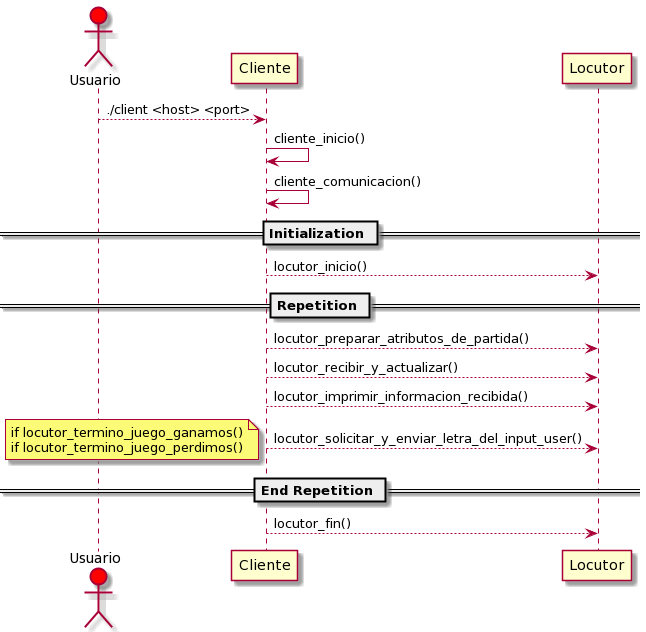

 # TRABAJO PRACTICO - JUEGO DEL AHORCADO
 
Alumno: Jesus Andres Correa Tornero

Padrón: 102310

Link : https://github.com/andy0013/AhorcadoTP1

# Introducción

  El trabajo practico consta de la interaccion de dos sujetos. Por un lado tenemos el Servidor, se ocupa de preparar los datos para la ejecucion del juego, y de organizar la logica. Él mismo, tiene tambien la responsabilidad de ocuparse de enviar y recibir datos con el usuario, sin embargo, como se mencionara mas adelante, esto lo hacer delegando la responsabilidad al TDA que corresponda.
   Por otro lado, tenemos al cliente, éste solo se ocupa de recibir y enviar datos, pero no de forma aleatoria, sino que tambien tiene una estructura que corresponde al juego.
La informacion que corresponde al juego, y como se tratan casos particulares, son especificados en el Enunciado.

# Modelo del juego

Como se aprecia en la Figura 1, el juego consta de dos ramas que se ocupan de distintos funcionamientos. 
Por un lado, vemos que las estructuras correspondientes al flujo del Cliente y al flujo del Servidor derivan en el uso de Protocolo, y el mismo Protocolo, hace uso de Sockets para la comunicacion entre estas dos ramas.

Por un lado, tenemos el lado del Servidor, que hace uso del TDA Juego para ordenar la logica del ahorcado, es decir, cuando solicitar input, cuando leer archivo, cuando la palabra fue acertada, etc. 
Por otro lado, tenemos el Cliente, que hace uso del Locutor que ordena la logica de cuando enviar datos, cuando recibir datos, etc. 

 
 
 # Comunicacion Servidor
 
  El Servidor del juego es el que se ocupa por medio del Protocolo, de conectar y dejar en escucha el servidor, para que cuando el cliente quiera jugar, aceptarlo.
La logica de aceptar un cliente se utiliza en el TDA Juego, de forma de que el TDA Juego es aquel que sabe cuando necesita conectar con un cliente, y seguir la secuencia del juego del ahorcado.
Asi mismo, el servidor, hace uso de distintos TDAS para completar el flujo del ahorcado:

      -- Consola
      -- Lector_de_archivo
      -- Palabra

Estos TDA se ocupan en parte cada uno de su propia funcionalidad, de forma de que el TDA Juego, en ningun momento debe manipular informacion que no le pertenece, respetando el encapsulamiento. 
Un ejemplo seria cuando el Juego quiere saber si el usuario adivino la palabra en cuestion, para esto, le pregunta al TDA Palabra, si la palabra fue adivinada.

El Servidor fue desarrollado en un principio simplemente como la logica del Juego Ahorcado, en el cual era posible jugar por entrada standart. Posteriormente, se hizo la adicion del TDA Protocolo en el TDA consola,  que  es quien conoce la logica de envio de datos, y interactua con los Sockets.

### Diagrama Secuencial

  En el diagrama podemos observar como se delegan las responsabilidades a cada distinto TDA, para el flujo del Juego, vemos que la secuencia inicial del juego se realiza en el Loop del juego, y la condicion de corte es cuando el Jugador Gana o Pierde.
  Es importante recalcar que los metodos son ilustrativos, es decir, no tenemos un metodo que se encarga de "conectar_y_inercambiar_datos()", sino que representa a 2/3 metodos, en los cuales en cada uno se delega 1 responsabilidad. 
  
  *En "imagenes/servidor_modelo.png" encontramos el Diagrama de Secuencia sin estos metodos ilustrativos que sintetizan varias responsabilidades*

## Modelo Servidor

  La eleccion de este modelo para el Servidor, esta basada en ofrecer flexibilidad, la idea es que, el Servidor envia la orden de Jugar el TDA Juego, pero no sabe realmente su funcionamiento. Si fuese posible con una interfaz, podriamos hacer dos juegos que implementen esos metodos, y aplicar polimorfimo.
Asi mismo, sucede con la Consola, la consola tiene metodos para las acciones que requiere realizar:

    -- Obtener input del user. 
    -- Enviar palabra adivinada hasta ahora.
    -- intentos restantes.

  Todos estos items son una caja negra para la consola, que mediante el TDA Protocolo que contiene,  conoce la forma y como debe enviar la informacion. En cualquier caso, si quisieramos cambiar el protocolo de envio de datos, si quisieramos no enviar la cantidad de intentos, el TDA Consola no deberia ser modificado, deberiamos cambiar los metodos de protocolo, o utilizar TDA con protocolos distintos. Este nivel de abstraccion de lo que realizan los distintos TDA, nos otorga libertad de modificar funcionalidad en caso de ser necesario, o agregar funcionalidades sin problema, ya que cada TDA manipula su informacion.

# Comunicacion Cliente

El Cliente del juego a traves del Locutor, se encarga de interactuar con el Servidor al que esta conectado. El TDA locutor es el que conoce el funcionamiento del juego ahorcado, que esta en el Servidor al que estamos conectados.
De esta forma, el cliente simplemente se ocupa de organizar las directivas del locutor, y asi, recibir informacion, enviar informacion, mostrar ejecucion, todo en caso de ser necesario.
  El TDA Locutor es el que realmente entiende que hacer y cuando resolver. A traves de este TDA realizamos directivas como:

 
## Modelo Cliente

  En el modelo del cliente se busco una simetria con el modelo servidor, es decir, se busco encapsulamiento para la comunicacion. De esta forma, reiterando lo anterior, podriamos modificar los protocolos, y no deberiamos cambiar la funcionalidad del locutor, ni del cliente.

  Como se puede observar en el Diagrama, el Usuario desconoce que hace Locutor, o el Protocolo que utiliza para realizar las directivas. De hecho, la solicitud al usuario de ingresar una letra para el juego, desconoce si se hace desde el cliente, o desde el Locutor. La idea, es que cada TDA tenga una responsabilidad.
  Una observacion, es que hubiese sido interesante que las peticiones de ingreso de letra, imprimir la cantidad de intentos disponibles, etc. Sean levantadas de un archivo de texto, asi, pueden ser mas facilmente modificables en el codigo.

# Situaciones Particulares 
  Es importante compartir las situaciones de desarrollo en las cuales se presentaron algunas complicaciones de modelado o de logica. 

## Lenguaje 

  El lenguaje utilizado es una cuestion no menor al hablar del desarrollo del juego, en un principio, opte por iniciar con la logica del juego del ahorcado para familiarizarme con el uso de punteros, direcciones de memoria, reserva de memoria.
  
  Durante el desarrollo hubo que invertir una gran cantidad de tiempo debbugeando el proyecto para entender situaciones anomalas por no mala manipulacion de memoria en el juego.

Un ejemplo interesante, es que en un momento, cuando arranque con la integracion de los Sockets, con el Juego funcionando correctamente con sus respectivos modulos y entradas STDIN. Debido al error de no reservar memoria para algunas variables, al entrar en un Loop; en el cual se solicita letra al user, carga letra en la palabra actual, etc. Cada vez que volvia a iniciar el Loop los valores de distintos TDAs se perdian, se volvian valores nulos. 
  A pesar de tener esa valiosa informacion, ya que reconociamos en todo momento DONDE estaba o no la informacion, y CUANDO se volvian nulos, fue dificil hallar y corregir la falla. 

## Conexion

  Otro desafio interesante del desarrollo del juego, es la implementacion de los Sockets. 
Aprovecho el momento para otorgar credito al repositorio de conexion de Sockets que nos otorgo la catedra como ejemplo, para realizar el TP. Ya que fueron una guia mas que necesaria para armar la Red en el TP.

https://github.com/Taller-de-Programacion/clases/tree/master/sockets-mdipaola

  Volviendo al problema que se me presento con el Servidor - Cliente, fue cuando en un principio desarrolle las funciones para que el Socket pueda recibir informacion, una vez finalizado ese desarrollo, queria probarlo, debia probarlo, no podia seguir desarrollando si no sabia si esa conexion estaba correctamente hecha, y podia intercambiar datos.
  Sin embargo, desconocia como realizar esta prueba. 
  
¿Debia levantar un proyecto como cliente?, ¿Debia si o si crear el socket de envio para probar el de recepcion?.
  
  La solucion a este problema estaba en el informe, y es que gracias al uso de Netcat, mediante Netcat, me era posible conectarme al servidor que levantaba desde Sockets, y ahi recien avanzaba en la solicitud (en modo debbug), posteriormente, tambien me era posible recibir informacion. Tambien pude utilizar este metodo viceversa para probar los envios del cliente a un servidor levantado.

 

 

 
